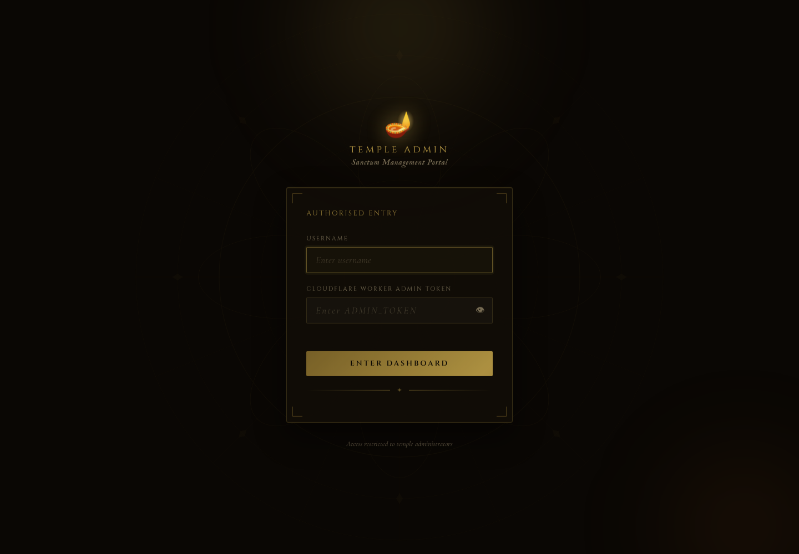
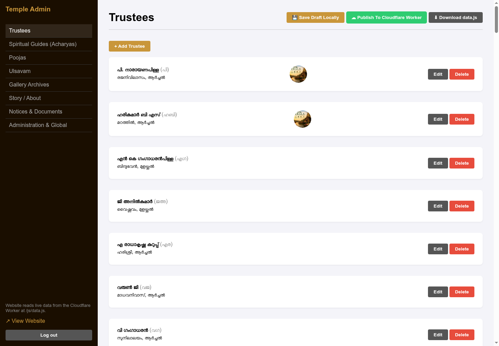

# Admin User Manual

This manual explains how temple administrators can update website content from the admin dashboard.

## Chapter 1: English

### 1. Login

1. Open `login.html`.
2. Enter the admin token configured in the Cloudflare Worker as `ADMIN_TOKEN`.
3. Click **Enter Dashboard**.

If login fails, confirm that the token is correct and that the Cloudflare Worker is reachable.

### 2. Dashboard Basics

The left sidebar contains these sections:

- Trustees
- Spiritual Guides (Acharyas)
- Poojas
- Ulsavam
- Gallery Archives
- Story / About
- Notices & Documents
- Administration & Global

The top-right actions are:

- **Save Draft Locally** - saves the current data only on this browser/device.
- **Publish To Cloudflare Worker** - publishes changes to the live website.
- **Download data.js** - downloads a local backup of the current data.

Important: most section-level **Save** buttons only save changes in memory. The live website changes only after clicking **Publish To Cloudflare Worker**.

### 3. Trustees

Use this section to manage trustee names, initials, addresses, and photos.

To add a trustee:

1. Open **Trustees**.
2. Click **Add Trustee**.
3. Enter the trustee name.
4. Edit the generated entry if needed.
5. Click **Save**.
6. Click **Publish To Cloudflare Worker**.

To upload a trustee photo:

1. Click **Edit** on the trustee.
2. Choose a photo file.
3. Click **Upload Photo**.
4. Wait for upload completion.
5. Click **Save**.
6. Click **Publish To Cloudflare Worker**.

### 4. Spiritual Guides / Acharyas

Use this section to manage Tantri, Sthapathi, or other guide profiles.

Each Acharya entry supports:

- name
- role
- photo

After editing or uploading a photo, click **Save**, then **Publish To Cloudflare Worker**.

### 5. Poojas

Use this section to add, edit, or remove poojas and homams.

Each pooja has:

- name
- description
- benefit

After changes, click **Save**, then **Publish To Cloudflare Worker**.

### 6. Ulsavam

Use this section to update festival year, start date, end date, and daily programme details.

To update general festival information:

1. Open **Ulsavam**.
2. Edit year, start date, and end date.
3. Click **Update Info**.
4. Click **Publish To Cloudflare Worker**.

To update a day:

1. Click **Edit** on the required day.
2. Edit date, title, details, and programmes.
3. Enter one programme per line.
4. Format programme lines as `09:30 Programme name`.
5. Click **Save Day**.
6. Click **Publish To Cloudflare Worker**.

### 7. Gallery Archives

Use this section to create albums and upload gallery photos.

To create an album:

1. Open **Gallery Archives**.
2. Click **New Album**.
3. Enter the album name.

To upload photos:

1. Select the album.
2. Choose one or more image files.
3. Click **Upload**.
4. Wait until the upload status says complete.
5. Edit captions if required.
6. Click **Publish To Cloudflare Worker**.

You can also paste an existing image URL manually, but direct upload is preferred.

### 8. Story / About

Use this section to edit the temple history text.

Each paragraph should be separated by a blank line. After editing:

1. Click **Save Story**.
2. Click **Publish To Cloudflare Worker**.

### 9. Notices & Documents

Use this section to manage public document links such as notices, PDFs, byelaws, and minutes.

Each document has:

- title
- URL
- type

After editing, click **Save Documents**, then **Publish To Cloudflare Worker**.

### 10. Administration & Global

This section controls:

- desktop hero image URL
- notification popup
- administration/contact members

To update the hero image:

1. Upload or paste a hero image URL.
2. Click **Set Hero**.
3. Click **Publish To Cloudflare Worker**.

To show a notification:

1. Tick **Enable Notification Banner**.
2. Enter title and message.
3. Click **Save Global Settings**.
4. Click **Publish To Cloudflare Worker**.

To hide the notification, untick the checkbox, save global settings, and publish.

### 11. Backup

After major changes:

1. Click **Download data.js**.
2. Store the file safely with the date.

This backup can help restore the website if Cloudflare data is accidentally changed.

### 12. Logout

Click **Log out** from the sidebar when finished, especially on shared computers.

## Chapter 2: Malayalam

### 1. ലോഗിൻ ചെയ്യുന്നത്

1. `login.html` തുറക്കുക.
2. Cloudflare Worker-ൽ `ADMIN_TOKEN` ആയി നൽകിയിരിക്കുന്ന അഡ്മിൻ ടോക്കൺ നൽകുക.
3. **Enter Dashboard** അമർത്തുക.

ലോഗിൻ സാധിക്കാത്ത പക്ഷം ടോക്കൺ ശരിയാണോ എന്നും Worker ലഭ്യമാണോ എന്നും പരിശോധിക്കുക.

### 2. ഡാഷ്ബോർഡ് അടിസ്ഥാനങ്ങൾ

ഇടത് വശത്തെ മെനുവിൽ പ്രധാന വിഭാഗങ്ങൾ കാണാം:

- Trustees
- Spiritual Guides (Acharyas)
- Poojas
- Ulsavam
- Gallery Archives
- Story / About
- Notices & Documents
- Administration & Global

മുകളിൽ വലതു വശത്തെ ബട്ടണുകൾ:

- **Save Draft Locally** - ഈ ബ്രൗസറിലോ ഉപകരണത്തിലോ മാത്രം ഡ്രാഫ്റ്റ് സൂക്ഷിക്കും.
- **Publish To Cloudflare Worker** - മാറ്റങ്ങൾ ലൈവ് വെബ്സൈറ്റിൽ പ്രസിദ്ധീകരിക്കും.
- **Download data.js** - നിലവിലെ ഡാറ്റയുടെ ബാക്കപ്പ് ഡൗൺലോഡ് ചെയ്യും.

ശ്രദ്ധിക്കുക: ഓരോ വിഭാഗത്തിനുള്ളിലെ **Save** ബട്ടൺ അമർത്തിയാൽ മാത്രം ലൈവ് സൈറ്റിൽ മാറ്റം വരില്ല. അവസാനം **Publish To Cloudflare Worker** അമർത്തണം.

### 3. Trustees

ട്രസ്റ്റിമാരുടെ പേര്, initials, വിലാസം, ഫോട്ടോ എന്നിവ ഇവിടെ മാറ്റാം.

പുതിയ trustee ചേർക്കാൻ:

1. **Trustees** തുറക്കുക.
2. **Add Trustee** അമർത്തുക.
3. പേര് നൽകുക.
4. ആവശ്യമെങ്കിൽ വിവരങ്ങൾ തിരുത്തുക.
5. **Save** അമർത്തുക.
6. **Publish To Cloudflare Worker** അമർത്തുക.

ഫോട്ടോ അപ്ലോഡ് ചെയ്യാൻ:

1. trustee-യുടെ **Edit** അമർത്തുക.
2. ഫോട്ടോ തിരഞ്ഞെടുക്കുക.
3. **Upload Photo** അമർത്തുക.
4. അപ്ലോഡ് പൂർത്തിയായ ശേഷം **Save** അമർത്തുക.
5. **Publish To Cloudflare Worker** അമർത്തുക.

### 4. Spiritual Guides / Acharyas

Tantri, Sthapathi, മറ്റ് ആചാര്യന്മാർ എന്നിവരുടെ വിവരങ്ങൾ ഇവിടെ മാറ്റാം.

ഓരോ entry-യിലും:

- പേര്
- role
- ഫോട്ടോ

മാറ്റങ്ങൾ ചെയ്ത ശേഷം **Save**, പിന്നെ **Publish To Cloudflare Worker** അമർത്തുക.

### 5. Poojas

പൂജകളും ഹോമങ്ങളും ചേർക്കാനും തിരുത്താനും നീക്കം ചെയ്യാനും ഈ വിഭാഗം ഉപയോഗിക്കുക.

ഓരോ pooja-ക്കും:

- പേര്
- വിവരണം
- benefit

മാറ്റങ്ങൾ കഴിഞ്ഞാൽ **Save**, പിന്നെ **Publish To Cloudflare Worker** അമർത്തുക.

### 6. Ulsavam

ഉത്സവ വർഷം, ആരംഭ തീയതി, അവസാന തീയതി, ഓരോ ദിവസത്തെയും programme എന്നിവ ഇവിടെ മാറ്റാം.

പൊതുവിവരം മാറ്റാൻ:

1. **Ulsavam** തുറക്കുക.
2. year, start date, end date മാറ്റുക.
3. **Update Info** അമർത്തുക.
4. **Publish To Cloudflare Worker** അമർത്തുക.

ഓരോ ദിവസം തിരുത്താൻ:

1. ആവശ്യമുള്ള ദിവസത്തിന്റെ **Edit** അമർത്തുക.
2. date, title, details, programmes തിരുത്തുക.
3. ഓരോ programme-വും ഓരോ വരിയായി എഴുതുക.
4. format: `09:30 Programme name`
5. **Save Day** അമർത്തുക.
6. **Publish To Cloudflare Worker** അമർത്തുക.

### 7. Gallery Archives

ഫോട്ടോ ആൽബങ്ങളും ഗാലറി ചിത്രങ്ങളും ഇവിടെ നിയന്ത്രിക്കാം.

ആൽബം ചേർക്കാൻ:

1. **Gallery Archives** തുറക്കുക.
2. **New Album** അമർത്തുക.
3. ആൽബത്തിന്റെ പേര് നൽകുക.

ഫോട്ടോ അപ്ലോഡ് ചെയ്യാൻ:

1. ആൽബം തിരഞ്ഞെടുക്കുക.
2. ഒരു അല്ലെങ്കിൽ കൂടുതൽ ഫോട്ടോകൾ തിരഞ്ഞെടുക്കുക.
3. **Upload** അമർത്തുക.
4. upload complete എന്ന് കാണുന്നതുവരെ കാത്തിരിക്കുക.
5. ആവശ്യമെങ്കിൽ caption മാറ്റുക.
6. **Publish To Cloudflare Worker** അമർത്തുക.

പഴയ image URL paste ചെയ്യാനും കഴിയും, പക്ഷേ direct upload ആണ് നല്ലത്.

### 8. Story / About

ക്ഷേത്ര ചരിത്രം ഇവിടെ തിരുത്താം.

ഓരോ paragraph-നും ഇടയിൽ ഒരു blank line നൽകുക. തിരുത്തിയ ശേഷം:

1. **Save Story** അമർത്തുക.
2. **Publish To Cloudflare Worker** അമർത്തുക.

### 9. Notices & Documents

Notices, PDFs, byelaws, minutes തുടങ്ങിയ document links ഇവിടെ ചേർക്കാം.

ഓരോ document-നും:

- title
- URL
- type

മാറ്റങ്ങൾ കഴിഞ്ഞാൽ **Save Documents**, പിന്നെ **Publish To Cloudflare Worker** അമർത്തുക.

### 10. Administration & Global

ഈ വിഭാഗത്തിൽ മാറ്റാവുന്നത്:

- desktop hero image URL
- notification popup
- administration/contact members

Hero image മാറ്റാൻ:

1. ചിത്രം upload ചെയ്യുക അല്ലെങ്കിൽ URL paste ചെയ്യുക.
2. **Set Hero** അമർത്തുക.
3. **Publish To Cloudflare Worker** അമർത്തുക.

Notification കാണിക്കാൻ:

1. **Enable Notification Banner** tick ചെയ്യുക.
2. title, message നൽകുക.
3. **Save Global Settings** അമർത്തുക.
4. **Publish To Cloudflare Worker** അമർത്തുക.

Notification മറയ്ക്കാൻ checkbox untick ചെയ്ത് save ചെയ്ത് publish ചെയ്യുക.

### 11. Backup

പ്രധാന മാറ്റങ്ങൾ കഴിഞ്ഞാൽ:

1. **Download data.js** അമർത്തുക.
2. തീയതി ചേർത്ത് ഫയൽ സുരക്ഷിതമായി സൂക്ഷിക്കുക.

Cloudflare data അബദ്ധത്തിൽ മാറിയാൽ restore ചെയ്യാൻ ഇത് സഹായിക്കും.

### 12. Logout

പ്രവർത്തനം കഴിഞ്ഞാൽ **Log out** അമർത്തുക. Shared computer ആണെങ്കിൽ ഇത് നിർബന്ധമാണ്.
